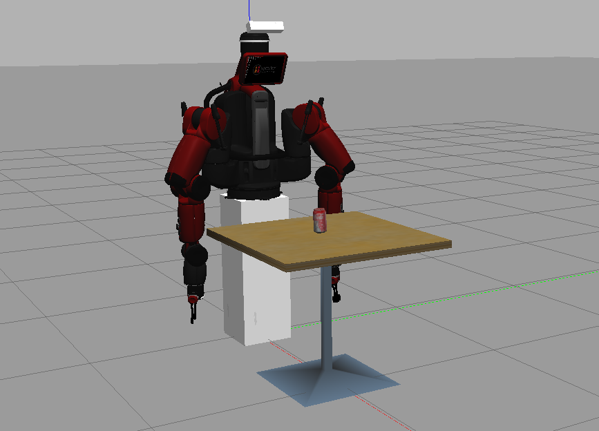
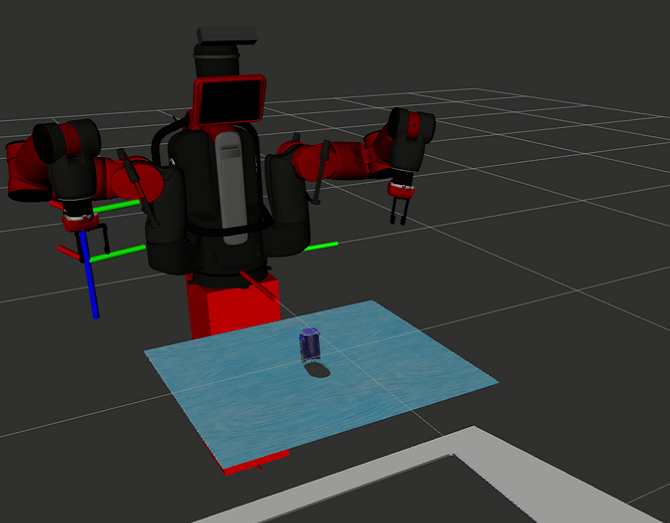
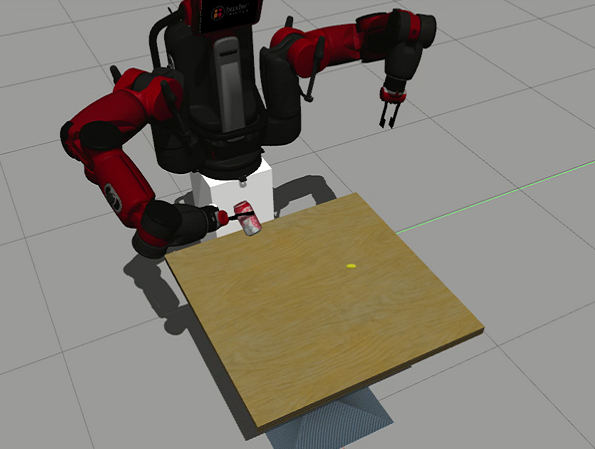
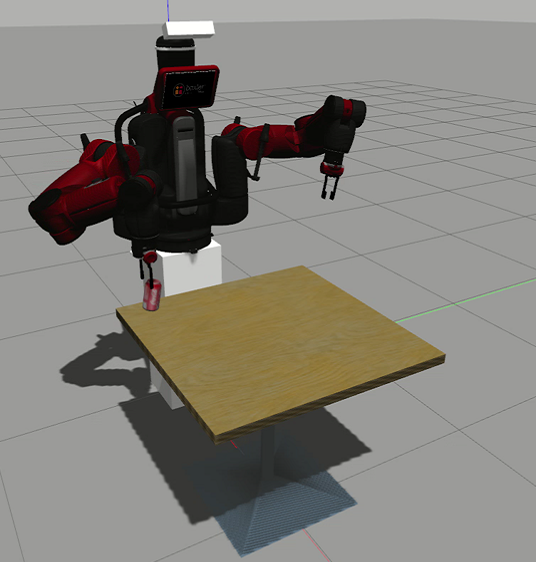

# 1.Summary
Here you can use the following instructions and instructions to complete the process of picking up the coke can from the side by the baxter robot. Completed instructions and corresponding instructions and given, and finally you can see the simulated video
# 2.Quickstart
The following steps can quickly complete the download and compilation process of ROS
## 2.1 Install ROS
you need to download the ROS_noetice version,you can download from here http://wiki.ros.org/kinetic/Installation/Ubuntu

## 2.1 Git clone necesay packages

Then,Create a ROS environment and download the necessary packages,You can use the following commands:
```bash
mkdir -p $HOME/Coke_ws/src
git clone https://github.com/rojas70/hlearning_ros_external_pkgs_noetic.git
git clone https://github.com/rojas70/learning_ros_noetic.git
git clone https://github.com/fcr032899/MAGE5755-final-project
 ```
## 2.3 Build the workspace
```bash
cd $HOME/Coke_ws/
Catkin_make
````
So far, you have completed all the prerequisite preparations

# 3.Overview
Run cmd to grab coke can from side
Before running cmd,please 
```
souce ./devel/setup.bash
```
1st cmd:  Start an empty gazebo world
```
roslaunch  gazebo_ros  empty_world.launch
```
2nd cmd:  Add baxter robots, tables, coke cans and other objects
```
roslaunch baxter_variations baxter_on_pedestal_w_kinect_coke.launch 
```

3rd cmd:  Start RVIZ and make the baxter robot arm in pre_pose
```
roslaunch coordinator coord_vision_manip_coke.launch
```



4th cmd : Grab coke can

```
rosrun coordinator acquire_coke_can_client
```

5th cmd :Put down the coke can

```
rosrun coordinator dropoff_coke_can_client
```




# 4.Video
You can watch the full simulation process form :

[youtube video](https://www.youtube.com/watch?v=3I2kVjDQLXQ)
# 5.FAQ
When using the baxter robot to grab the coke can, you may encounter the situation where the baxter grabbing width is not enough. You need to change the finger extension from narrow to wide in the right_end_effector.urdf.xacro in the baxter robot.


